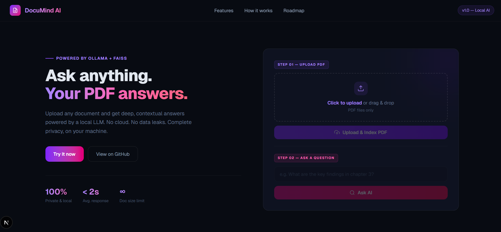
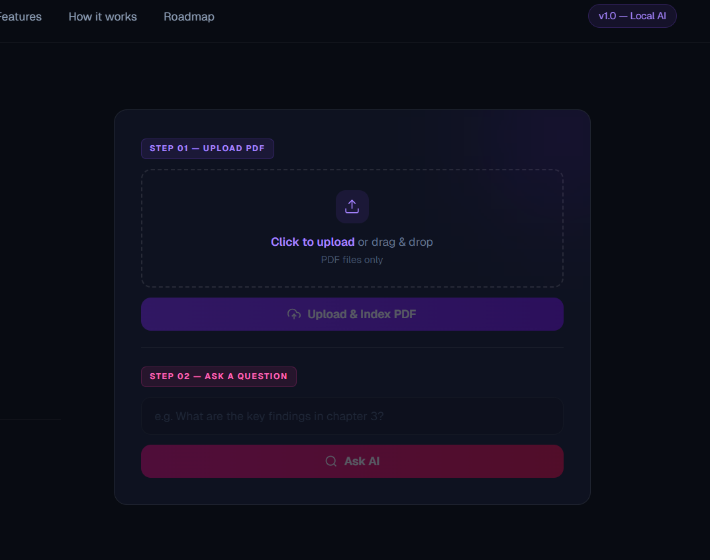

# 🚀 DocuMind AI

DocuMind AI is an intelligent document analysis platform that enables users to upload PDFs and interact with them using natural language queries. It extracts, understands, and delivers precise answers instantly using AI.

---

## 1. 🧠 Business Problem

Professionals and students frequently work with large PDF documents such as:

* Research papers
* Technical reports
* Academic materials

Finding specific information manually is:

* Time-consuming
* Inefficient
* Error-prone

There is a growing need for a system that can **quickly interpret documents and provide accurate answers on demand**.

---

## 2. 💡 Possible Solution

A smart AI-driven system that:

* Accepts PDF uploads
* Processes and understands document content
* Allows users to ask questions in natural language
* Returns context-aware answers

This significantly reduces manual effort and improves productivity.

---

## 3. ⚙️ Implemented Solution

DocuMind AI is a full-stack application that:

* Uploads and processes PDF documents
* Splits content into manageable chunks
* Converts text into vector embeddings
* Stores embeddings using FAISS
* Retrieves relevant context using similarity search
* Uses an LLM to generate accurate answers

This ensures:

* Fast response time
* Contextual understanding
* Interactive experience

---

## 4. 🛠️ Tech Stack Used

### Frontend:

* Next.js (React)
* Tailwind CSS
* Framer Motion

### Backend:

* FastAPI (Python)

### AI / ML:

* LangChain
* HuggingFace Embeddings
* FAISS (Vector Database)
* Ollama (LLM - Mistral / Phi)

---

## 5. 🏗️ Architecture Diagram

```
User (Next.js Frontend)
        ↓
API Requests (Upload / Ask)
        ↓
FastAPI Backend
        ↓
PDF Loader → Text Splitter
        ↓
Embeddings (HuggingFace)
        ↓
FAISS Vector Store
        ↓
Retriever (Similarity Search)
        ↓
LLM (Ollama)
        ↓
Response → Frontend
```

---

## 6. ▶️ How to Run Locally

### Step 1: Clone Repository

```bash
git clone <your-repo-link>
cd AI-Web-App
```

---

### Step 2: Backend Setup

```bash
pip install -r requirements.txt
```

Run backend:

```bash
python -m uvicorn main:app
```

Backend runs at:

```
http://localhost:8000
```

---

### Step 3: Frontend Setup

```bash
cd ai-ui
npm install
npm run dev
```

Frontend runs at:

```
http://localhost:3000
```

---

### Step 4: Usage

1. Upload a PDF
2. Enter your query
3. Click **Ask AI**
4. Get AI-powered answers instantly

---

## 7. 📚 References & Resources Used

* FastAPI Documentation
* LangChain Documentation
* HuggingFace Models
* FAISS Documentation
* Ollama Documentation
* Next.js & React Docs
---

## 9. 📸 Screenshots

### 🔹 Home Interface



### 🔹 PDF Upload Flow



### 🔹 AI Answer Output


---

## 10. 📐 Formatting & Design

* Modern gradient UI
* Responsive layout
* Smooth animations (Framer Motion)
* Clean and intuitive UX

---

## 11. ⚠️ Challenges Faced & Solutions

### 🔴 CORS Issues

**Problem:** Frontend requests were blocked
**Solution:** Proper configuration of FastAPI CORS middleware

---

### 🔴 Backend State Reset

**Problem:** FAISS database was resetting during reload
**Solution:** Avoided using `--reload` while testing

---

### 🔴 LangChain Import Errors

**Problem:** Deprecated module imports
**Solution:** Updated to `langchain_community` and latest packages

---

### 🔴 Frontend API Bugs

**Problem:** API calls not executing due to incorrect async logic
**Solution:** Refactored functions and used `fetch` properly

---

### 🔴 Slow AI Responses

**Problem:** Delay in generating answers
**Solution:** Optimized chunk size and prompt structure

---

# 🎯 Conclusion

DocuMind AI demonstrates how modern AI systems can transform document interaction by making information retrieval fast, intuitive, and intelligent.

---

# 🚀 Future Improvements

* Cloud deployment (Frontend + Backend)
* Replace local LLM with scalable API-based models
* Add chat history & memory
* Improve performance and UI polish
* Multi-document support

---
